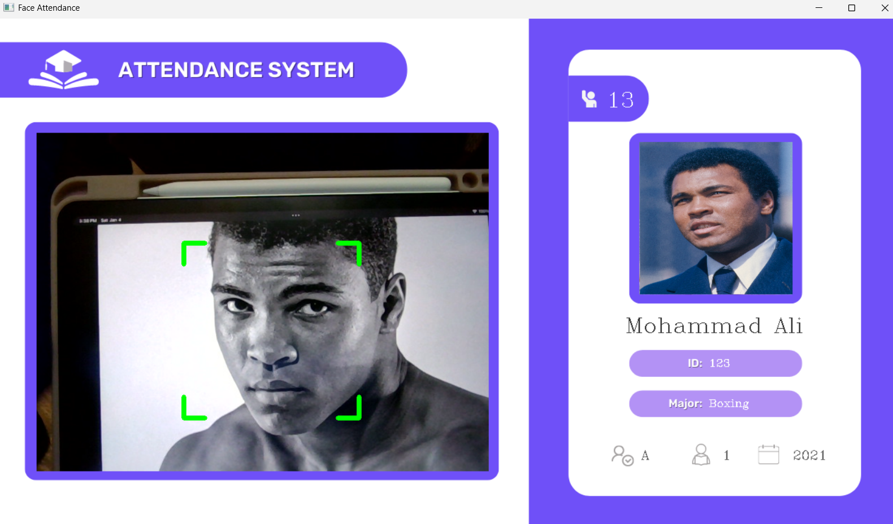
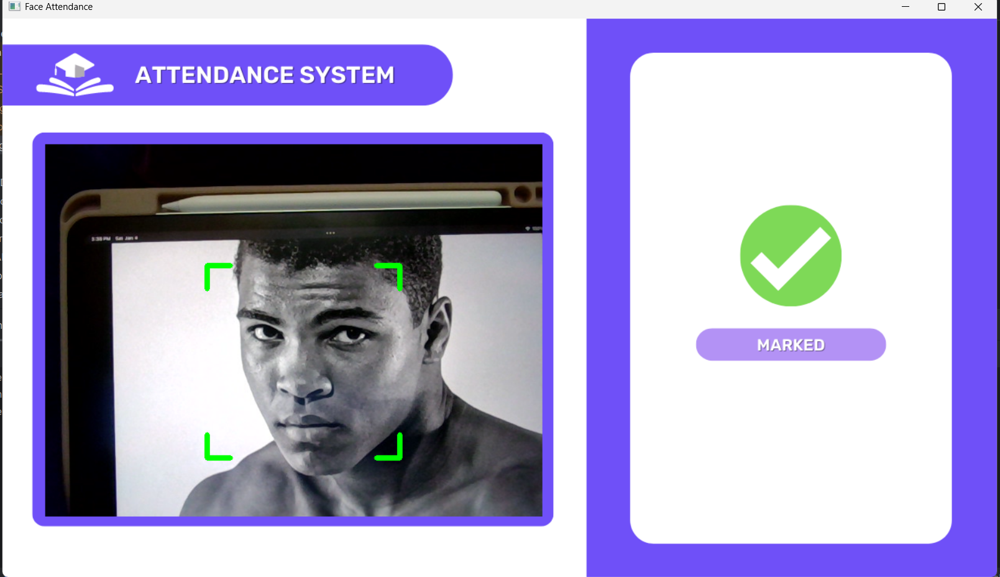
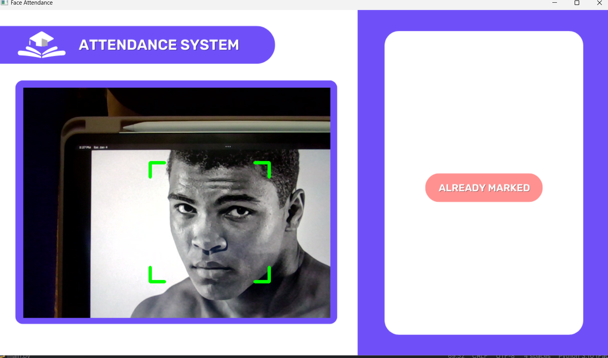
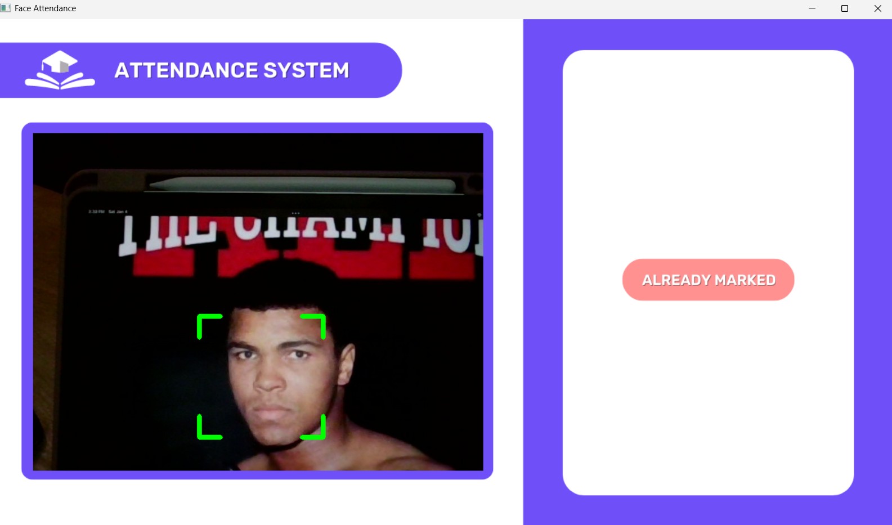

# Face Detection and Real-Time Attendance System

This project is a real-time attendance management system using face recognition. The system identifies students based on their faces, updates their attendance in a MySQL database, and displays relevant information dynamically. The project is inspired by [Murtaza's Workshop - Robotics and AI](https://www.youtube.com/watch?v=iBomaK2ARyI&t=7493s&ab_channel=Murtaza%27sWorkshop-RoboticsandAI) but replaces Firebase with MySQL for database management.

---
## Overview of Some Features





## Features

### 1. **Face Recognition**
- Identifies faces in real-time using OpenCV and `face_recognition`.
- Matches detected faces with pre-encoded data for student IDs.

### 2. **Dynamic Attendance Management**
- Updates attendance records in a MySQL database.
- Prevents duplicate attendance within 24 hours.
- Displays personalized student information and their photo when attendance is marked.

### 3. **Student Image Management**
- Allows uploading and storing student images in the MySQL database as BLOB data.
- Uses these images for real-time identification and overlaying during detection.

### 4. **Modes of Operation**
- **Default Mode:** Displays a default background when no face is detected.
- **New Attendance:** Shows student info and marks attendance for the first detection in 24 hours.
- **Marked Attendance:** Confirms attendance has been marked.
- **Already Marked:** Indicates the student has already been marked for the day.

---

## How to Set Up

### 1. **MySQL Database Setup**
Create a MySQL database named `face_attendance_db` with the following structure:

```sql
CREATE TABLE students (
    id VARCHAR(50) PRIMARY KEY,
    name VARCHAR(100),
    major VARCHAR(100),
    starting_year INT,
    total_attendance INT DEFAULT 0,
    standing VARCHAR(10),
    year INT,
    last_attendance_time DATETIME,
    photo LONGBLOB
);
```

### 2. **Local Development Environment**
- Install Python 3.x.
- Install required Python libraries:
  ```bash
  pip install opencv-python opencv-contrib-python face_recognition mysql-connector-python
  ```

- Use XAMPP or WAMP for MySQL database management.

### 3. **Folder Structure**
Ensure the following folder structure:
```
project/
├── images/                  # Stores student images for encoding
├── res/                     # Stores background and mode images
├── EncodeFile.p             # Encoded face data
├── addDataToMySQL.py        # Script to insert/update student data
├── encodeGen.py             # Script to encode face data
├── main.py                  # Main program for real-time attendance
├── uploadImagesToDB.py      # Script to upload images to the database
```

---

## How It Works

### 1. **Student Data and Image Management**
- Use `addDataToMySQL.py` to insert/update student information in the database.
- Use `uploadImagesToDB.py` to upload student images to the database for display during recognition.

### 2. **Face Encoding**
Run `encodeGen.py` to generate face encodings from the `images/` directory and save them to `EncodeFile.p`.

### 3. **Real-Time Attendance**
Run `main.py` to start the real-time face detection and attendance system:
- The program reads face encodings from `EncodeFile.p`.
- It detects faces from the webcam feed, matches them with the database, and performs the following:
  - Marks attendance for students detected for the first time in 24 hours.
  - Displays their photo and information overlay.
  - Prevents re-marking attendance for the same day.

---

## Files and Purpose

### Python Files
- `addDataToMySQL.py`: Inserts student data into the database.
- `uploadImagesToDB.py`: Uploads student photos to the database.
- `encodeGen.py`: Generates face encodings from images.
- `main.py`: Runs the real-time attendance system.

### Other Files
- `EncodeFile.p`: Stores face encodings.
- `images/`: Directory for storing student images.
- `res/`: Directory for background and mode images.

---

## Technologies Used


---

## Future Enhancements

- **Improve UI:** Add a graphical user interface (GUI) for easier navigation.
- **Mobile Integration:** Develop a mobile app for viewing attendance records.
- **Notifications:** Implement email or SMS notifications for marked attendance.

---

This project simplifies attendance management by leveraging face recognition and MySQL. It is easy to extend and customize for educational or workplace settings.
